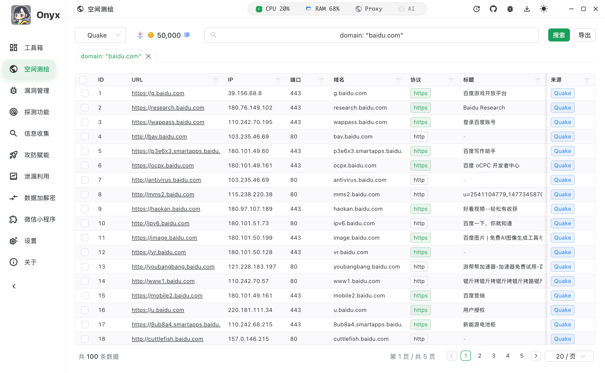
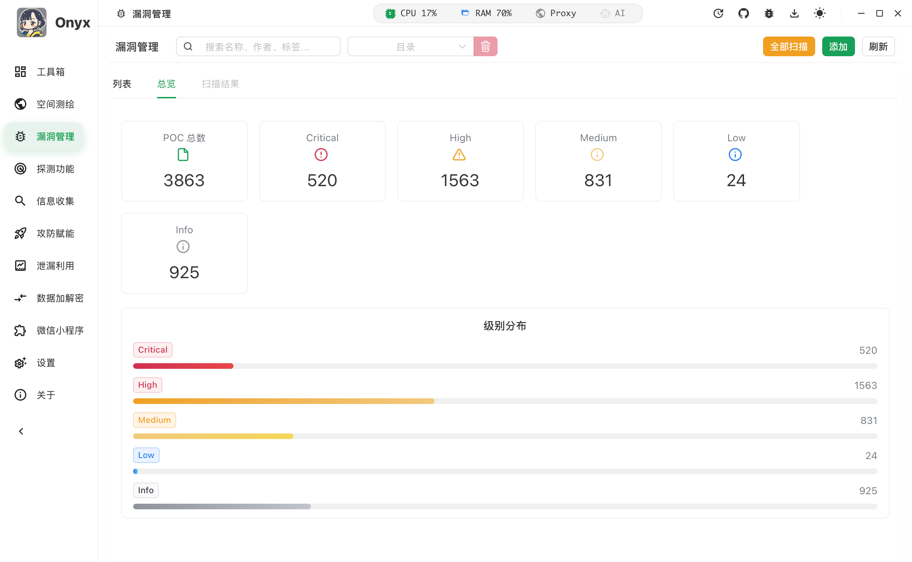
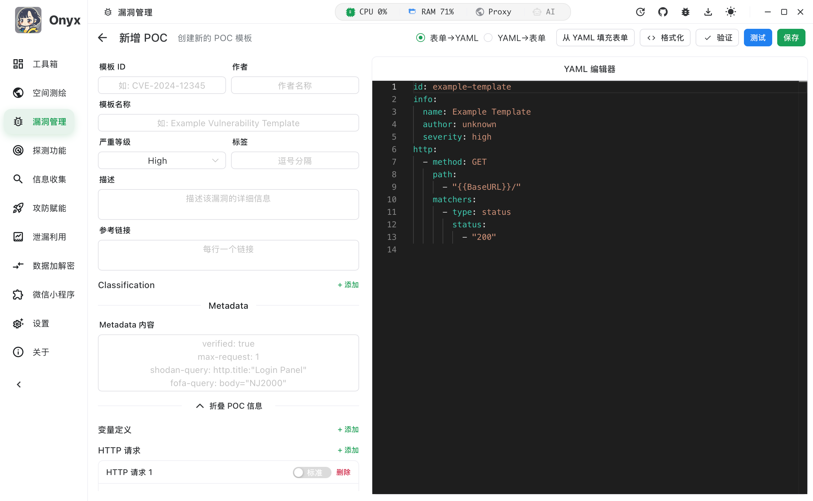
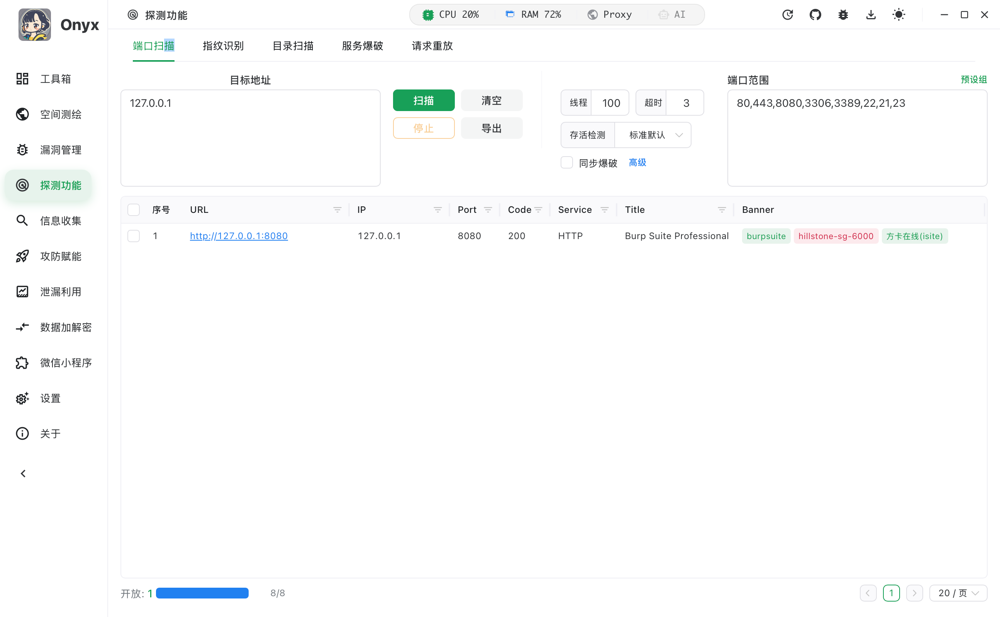
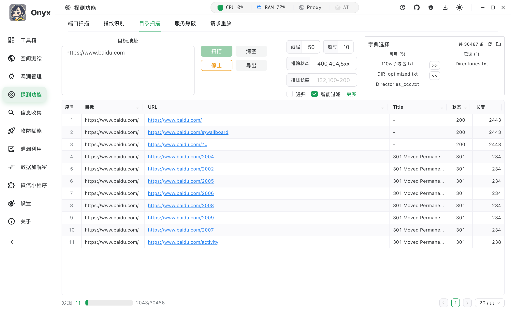
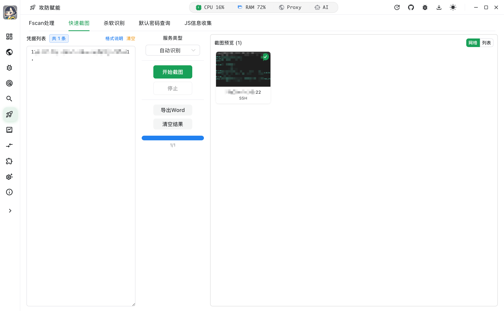
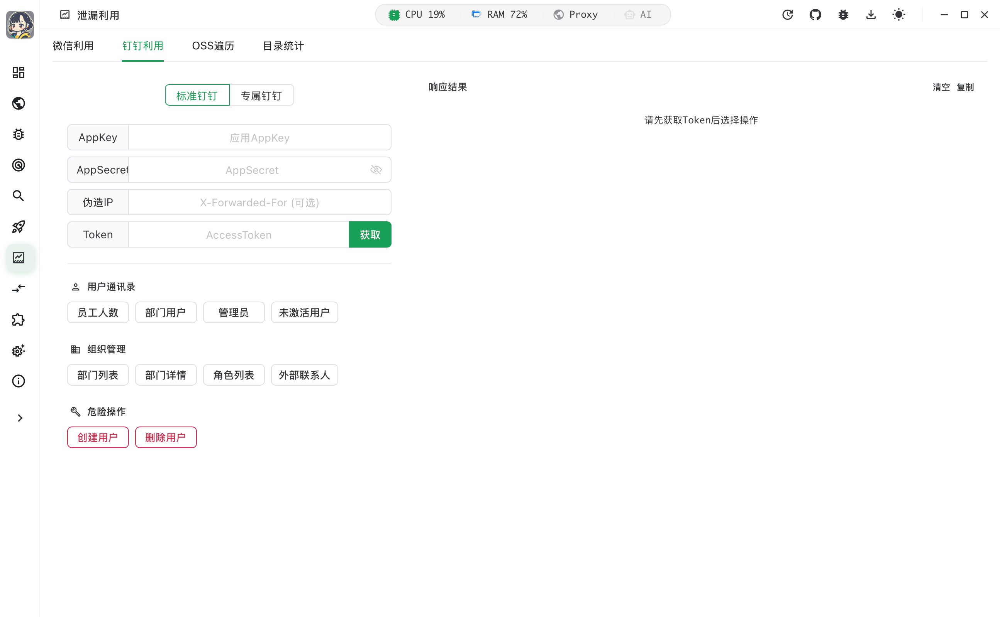
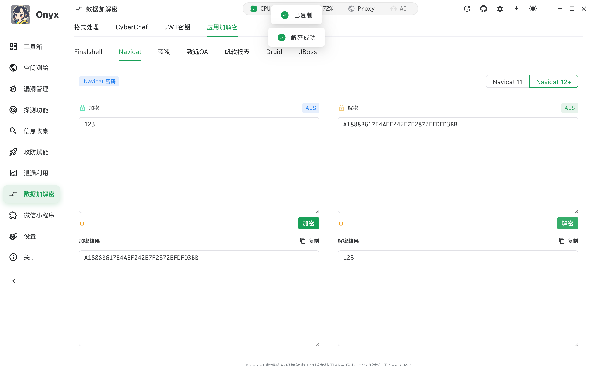
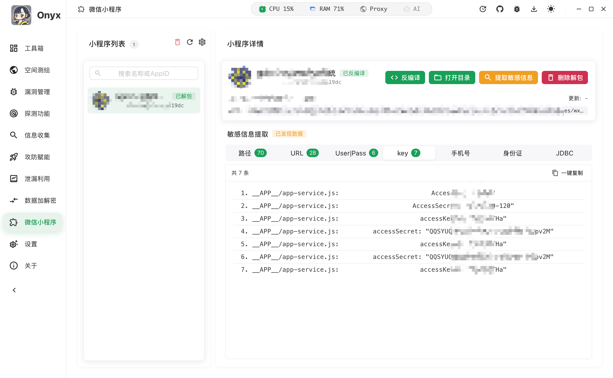

简体中文 | [English](README.md)

# Onyx - 安全测试工具集

**一款基于 Wails v2 + Vue 3 的跨平台安全测试桌面应用**

## 项目简介

**Onyx** 是一款安全测试工具集，集合多种渗透测试常用的功能和工具，赋能攻防、渗透等场景。整合空间测绘、漏洞扫描、主机探测、信息收集等能力，提供一站式的渗透测试工作台，告别需要到处切换工具、网站的麻烦。

### 

| 模块           | 说明                                                         |
| :------------- | :----------------------------------------------------------- |
| **空间测绘**   | 集成 **Fofa**、**Hunter**、**Quake** 三大测绘引擎，支持批量资产导出 |
| **漏洞扫描**   | 基于 **Nuclei** 引擎，支持 POC 管理、批量扫描、请求包可视化、一键生成验证图片 |
| **辅助工具**   | 内置 **CyberChef**、JWT 密钥爆破、编码转换、Fscan 结果处理、攻防批量截图 |
| **应用加解密** | 提供 **FinalShell**、**Navicat**、**蓝凌**、**致远**、**帆软**、**Druid**、**JBoss** 等常见应用/中间件的加解密工具 |
| **小程序分析** | 支持微信小程序自动识别、反编译 (`.wxapkg`)、敏感信息正则提取 |
| **企业信息**   | 支持 IP 归属地查询、ICP 备案信息查询、企业与股权结构分析     |
| **信息探测**   | 包含端口扫描、杀软识别、指纹识别、敏感信息采集 (JS 分析)     |

## 功能

### 快速启动工具箱

渗透测试工具快速启动

### 空间测绘

支持多种网络空间测绘引擎

### 漏洞扫描

- **Nuclei** - POC兼容Nuclei模板格式
- **POC 编辑器** - Monaco 编辑器，支持语法高亮
- **请求重放** - 支持自定义 HTTP 请求

**漏洞管理：**

**自定义POC：**

#### 请求重放

- 自定义 HTTP 请求
- 支持各种请求方法
- 实时查看请求和响应

#### 示例

### 信息搜集

- 通过域名查询相关企业信息

- 股权结构分析

- 资产收集与关联分析

### 攻防赋能

#### FScan 结果处理

自动解析和格式化 FScan 扫描结果

#### 快速截图

结果批量截图

#### 示例

### 泄漏利用

#### 微信利用

支持公众号、小程序、企业微信的 AK、SK 利用

#### 钉钉利用

支持标准钉钉、专属钉钉利用

#### 常见资产密文加解密

渗透测试常见高危资产密文加解密

### 微信小程序

- **自动扫描** - 自动扫描微信小程序
- **小程序反编译** - 微信小程序反编译与代码分析
- **小程序敏感信息搜集** - 自动提取小程序中的敏感信息
- **自定义正则表达式** - 支持自定义正则表达式进行信息匹配

## 感谢名单

感谢以下贡献者对本项目的支持：

<!-- CONTRIBUTORS:START -->

| 头像                                                         | 用户名 | 链接                                 |
| ------------------------------------------------------------ | ------ | ------------------------------------ |
|  | Mstce  | [@Mstce](https://github.com/Mstce)   |
|  | Y5neKO | [@Y5neKO](https://github.com/Y5neKO) |
|  | In1t0  | [@In1t0](https://github.com/In1t0)   |
| <!-- CONTRIBUTORS:END -->                                    |        |                                      |

## 快速开始

访问 [Releases](https://github.com/Mstce/Onyx/releases) 下载对应平台的安装包：

| 平台    | 格式                 |
| ------- | -------------------- |
| Windows | `.exe` / `.msi`      |
| macOS   | `.dmg` / `.app`      |
| Linux   | `.AppImage` / `.deb` |

## 免责声明

**重要提示：本工具仅供安全研究和授权测试使用。**

1. **授权要求** - 使用本工具前，必须获得目标系统所有者的明确授权
2. **法律责任** - 未经授权使用本工具进行测试可能违反《网络安全法》等相关法律法规
3. **使用风险** - 使用本工具产生的一切后果由使用者自行承担，作者不承担任何责任
4. **教育目的** - 本工具旨在帮助安全研究人员提升技能，加强网络安全防护

**请确保在合法合规的前提下使用本工具！**

## Star History

