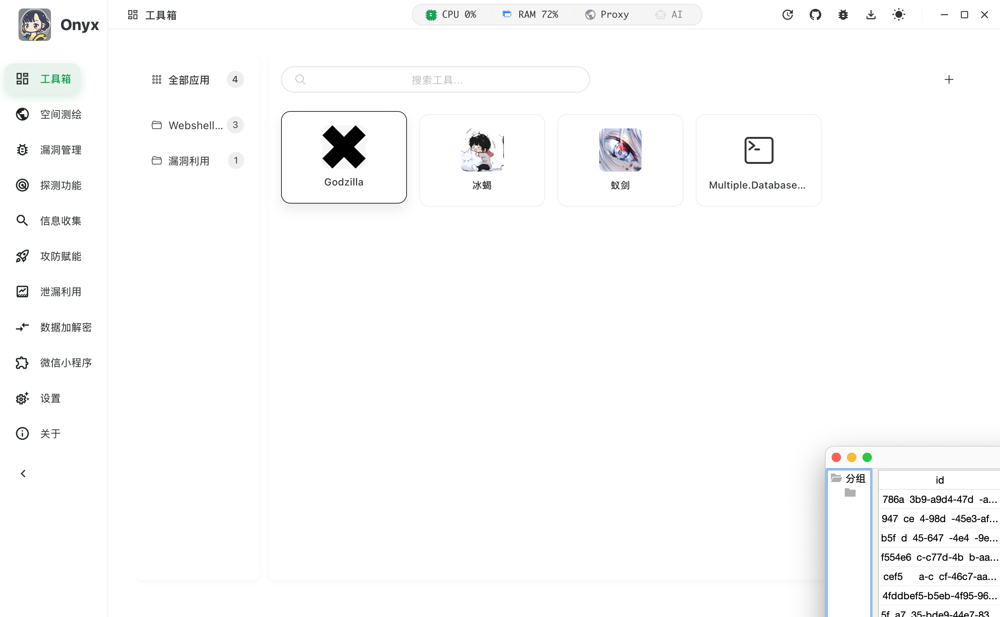

# Onyx

Onyx 是一款桌面化安全测试工具集，聚合空间测绘、漏洞扫描、资产探测、泄漏利用与常用攻防工具，面向授权测试场景。

## 功能模块

- 空间测绘：FOFA / Hunter / Quake 多引擎检索
- 漏洞扫描：Nuclei 模板管理、批量扫描、请求重放
- 资产探测：存活探测、端口扫描、指纹识别、主机碰撞
- 泄漏利用：OSS / ECS 凭证库与利用能力
- 工具集：编码解码、加解密、截图、结果处理等

## 截图

|  |  |  |
|---|---|---|
|  |  |  |
|  |  |  |

> 你只想展示部分页面时，直接替换或删除上面的单元格即可。

## 下载

- Releases：<https://github.com/Mstce/Onyx/releases>

macOS 首次打开若提示安全限制，可执行：

```bash
sudo xattr -d com.apple.quarantine Onyx.app
```

## 说明

- 本仓库为发布仓库（Release / 文档 / 资源索引）。
- 更新日志见 `CHANGELOG.md`，应用市场索引见 `APPMARKET.md`。

## 免责声明

本工具仅用于安全研究与授权测试。请确保在合法合规前提下使用，使用者自行承担风险与责任。
